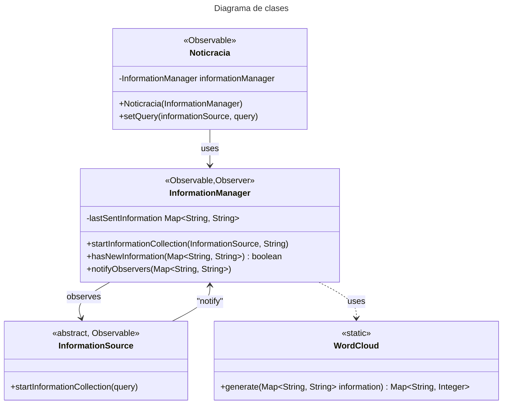

# Noticracia

```mermaid
---
title: Diagrama de clases
---
classDiagram
    class Noticracia {
        -InformationManager informationManager
        +Noticracia(InformationManager)
        +setQuery(informationSource, query)
        <<Observable>>
    }

    class InformationSource {
        <<abstract, Observable>>
        +startInformationCollection(query)
    }

    class InformationManager {
        -lastSentInformation Map~String, String~
        +startInformationCollection(InformationSource, String)
        +hasNewInformation(Map~String, String~) boolean
        +notifyObservers(Map~String, String~)
        <<Observable,Observer>>
    }

    class WordCloud {
        +generate(Map~String, String~ information) Map~String, Integer~
        <<static>>
    }

    Noticracia --> InformationManager : uses
    InformationManager --> InformationSource : observes
    InformationSource --> InformationManager : "notify"
    InformationManager ..> WordCloud : uses
```
