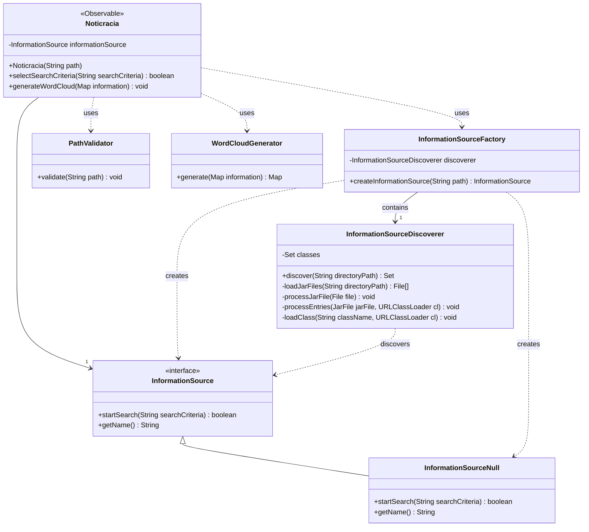

# Noticracia

## Diagrama de clases completo (Simplificar para el informe y pasarlo a otra herramienta)

```mermaid
classDiagram
    class Noticracia {
        <<Observable>>
        -InformationSource informationSource
        +Noticracia(String path)
        +selectSearchCriteria(String searchCriteria) boolean
        +generateWordCloud(Map information) void
    }
    class InformationSource {
        <<interface>>
        +startSearch(String searchCriteria) boolean
        +getName() String
    }
    class InformationSourceNull {
        +startSearch(String searchCriteria) boolean
        +getName() String
    }
    class InformationSourceDiscoverer {
        -Set classes
        +discover(String directoryPath) Set
        -loadJarFiles(String directoryPath) File[]
        -processJarFile(File file) void
        -processEntries(JarFile jarFile, URLClassLoader cl) void
        -loadClass(String className, URLClassLoader cl) void
    }
    class InformationSourceFactory {
        -InformationSourceDiscoverer discoverer
        +createInformationSource(String path) InformationSource
    }
    class PathValidator {
        +validate(String path) void
    }
    class WordCloudGenerator {
        +generate(Map information) Map
    }

    Noticracia --> "1" InformationSource
    Noticracia ..> InformationSourceFactory : uses
    Noticracia ..> WordCloudGenerator : uses
    Noticracia ..> PathValidator : uses
    InformationSource <|-- InformationSourceNull
    InformationSourceFactory --> "1" InformationSourceDiscoverer : contains
    InformationSourceFactory ..> InformationSource : creates
    InformationSourceFactory ..> InformationSourceNull : creates
    InformationSourceDiscoverer ..> InformationSource : discovers
```
