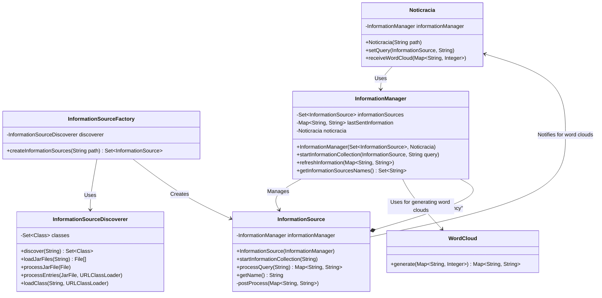

# Noticracia



```mermaid
participant UI as User Interface
participant Controller as UI Controller
participant Noticracia
participant InfoMgr as InformationManager
participant InfoSrc as InformationSource
participant WordCloud

UI->>+Controller: User selects candidate and query
Controller->>+Noticracia: setQuery(InformationSource, query)
Noticracia->>+InfoMgr: startInformationCollection(InformationSource, query)
InfoMgr->>+InfoSrc: startInformationCollection(query)
activate InfoSrc
InfoSrc->>InfoSrc: processQuery(query)
deactivate InfoSrc
InfoSrc->>-InfoMgr: postProcess(information)
InfoMgr->>+WordCloud: generate(information)
WordCloud-->>-InfoMgr: return wordCloud
InfoMgr-->>-Noticracia: receiveWordCloud(wordCloud)
Noticracia-->>-UI: displayWordCloud(wordCloud)
```