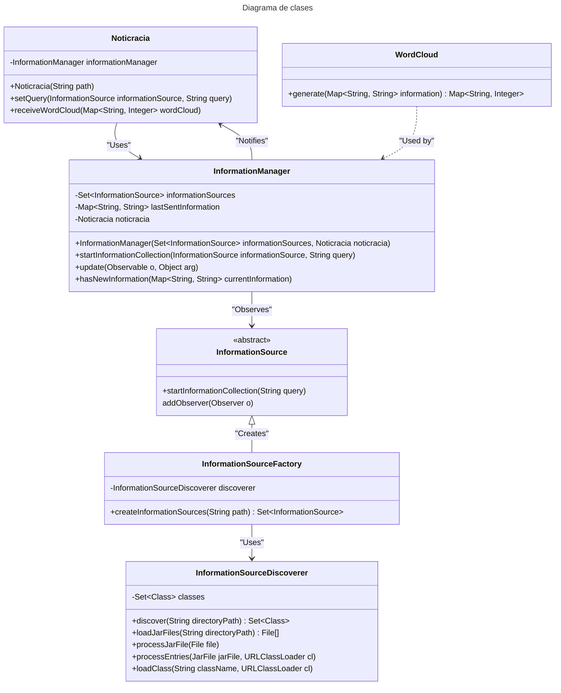

# Noticracia

```mermaid
---
title: Diagrama de clases
---
classDiagram
    class Noticracia {
        -InformationManager informationManager
        +Noticracia(String path)
        +setQuery(InformationSource informationSource, String query)
        +receiveWordCloud(Map~String, Integer~ wordCloud)
    }

    class InformationSource {
        <<abstract>>
        +startInformationCollection(String query)
        addObserver(Observer o)
    }

    class InformationSourceFactory {
        -InformationSourceDiscoverer discoverer
        +createInformationSources(String path) Set~InformationSource~
    }

    class InformationSourceDiscoverer {
        -Set~Class<? extends InformationSource>~ classes
        +discover(String directoryPath) Set~Class<? extends InformationSource>~
        +loadJarFiles(String directoryPath) File[]
        +processJarFile(File file)
        +processEntries(JarFile jarFile, URLClassLoader cl)
        +loadClass(String className, URLClassLoader cl)
    }

    class InformationManager {
        -Set~InformationSource~ informationSources
        -Map~String, String~ lastSentInformation
        -Noticracia noticracia
        +InformationManager(Set~InformationSource~ informationSources, Noticracia noticracia)
        +startInformationCollection(InformationSource informationSource, String query)
        +update(Observable o, Object arg)
        +hasNewInformation(Map~String, String~ currentInformation)
    }

    class WordCloud {
        +generate(Map~String, String~ information) Map~String, Integer~
    }

    Noticracia --> InformationManager : "Uses"
    InformationManager --> InformationSource : "Observes"
    InformationManager --> Noticracia : "Notifies"
    InformationSource <|-- InformationSourceFactory : "Creates"
    InformationSourceFactory --> InformationSourceDiscoverer : "Uses"
    WordCloud ..> InformationManager : "Used by"
```
