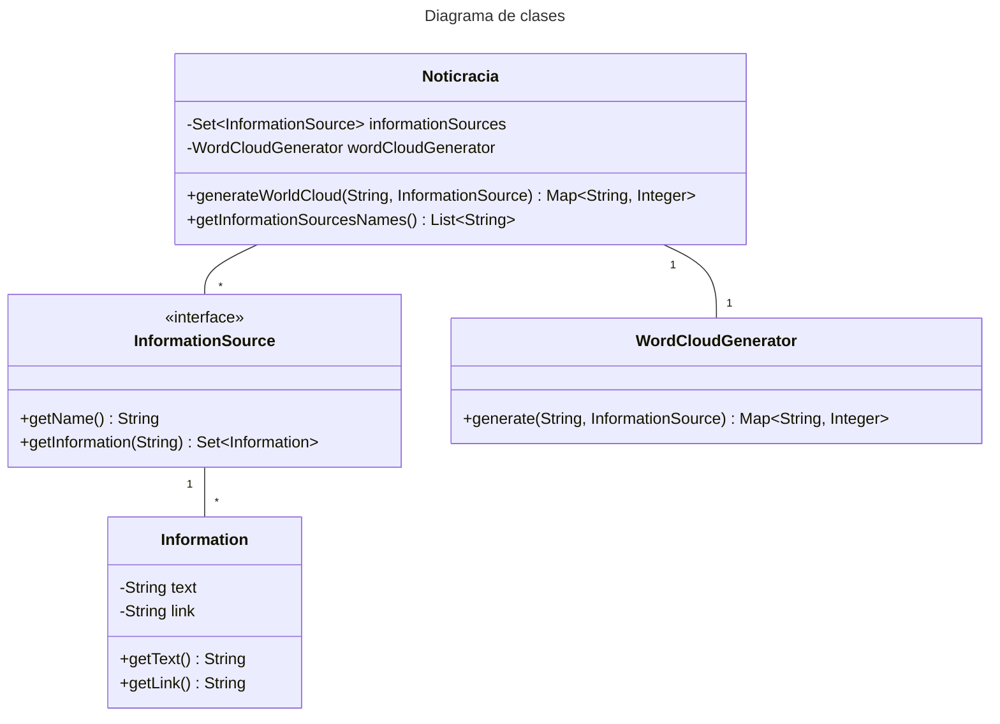

# Noticracia
 
Noticracia es un sistema que genera una nube de palabras la cual refleja las percepciones y temas predominantes asociados con un candidato político.

## Clases

### `NoticraciaCore`

Clase del modelo, tiene lo necesario para generar la nube de palabras. Tiene el atributo `Set<InformationSource> informationSources` que son todas las fuentes de información sobre las que puede generar una nube de palabras. También tiene el atributo `WordCloudGenerator` que es el generador de nubes de palabras.

El método `generateWorldCloud` es el encargado de devolver la nube de palabras armada en base a un nombre de candidato político dado, y una fuente de información dada.

### `Information`

Corresponde a la representación de lo que se encuentra en las fuentes de información. Contiene el atributo `text` que tendrá el valor de lo que se haya recolectado de la fuente de información y,  el atributo `link`, que contendrá una dirección web de la fuente directa de esta información.

### `InformationSource`

Es la interfaz que representa la fuente de información. Tiene la capacidad de obtener información sobre un político. Esta interfaz podra ser implementada por cada _plugin_ que se use en el sistema. Tiene dos metodos a implementar, el primero,  `getInformation` asegura que sus implementacion encuentren, a su forma, información sobre el nombre del candidato político dado y, el segundo, `getName` permite a obtener el nombre de la fuente que utiliza implementación.

