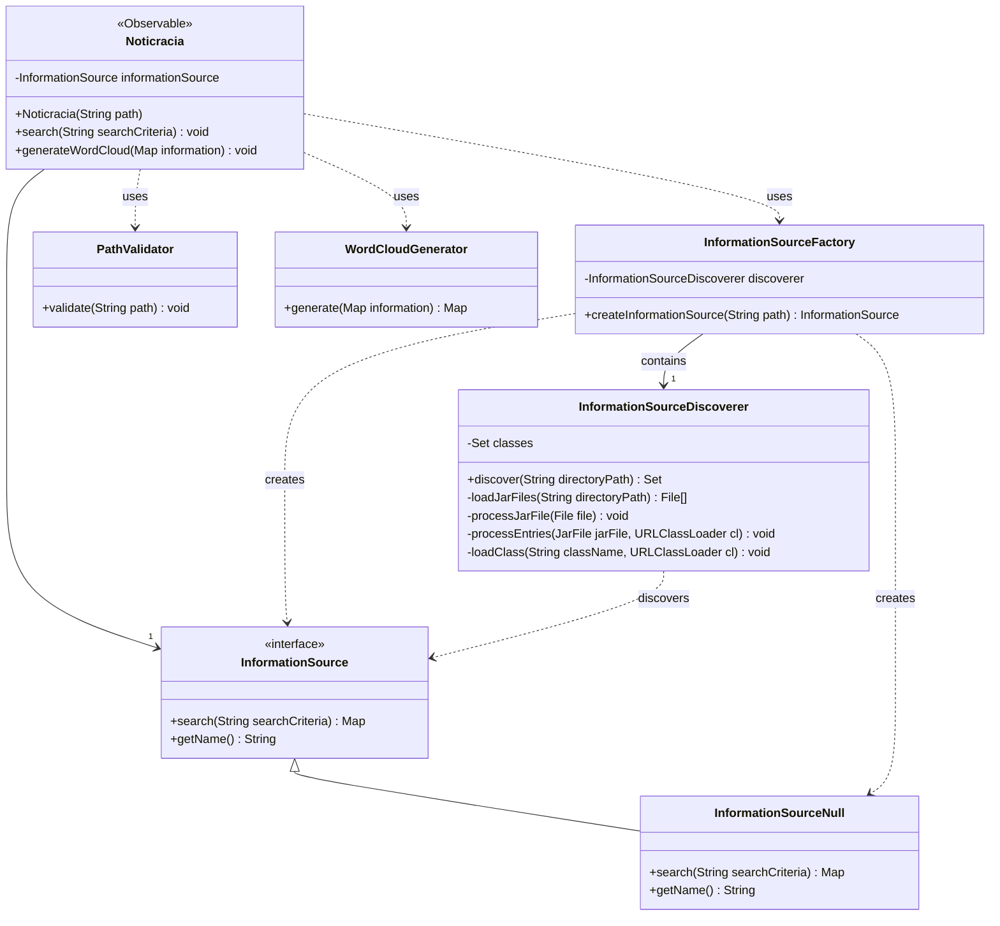
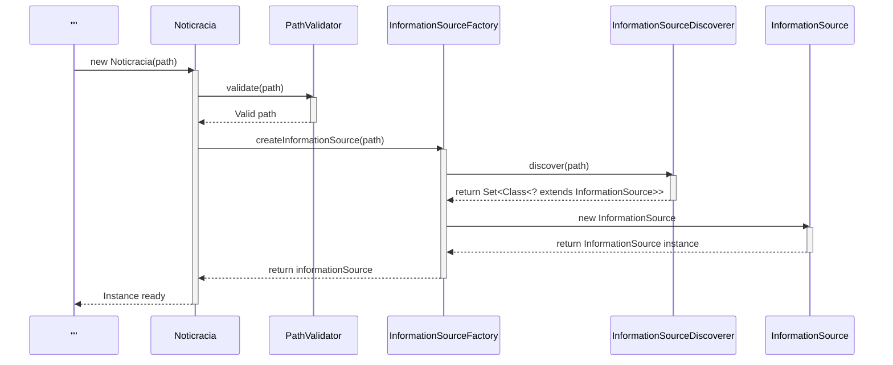
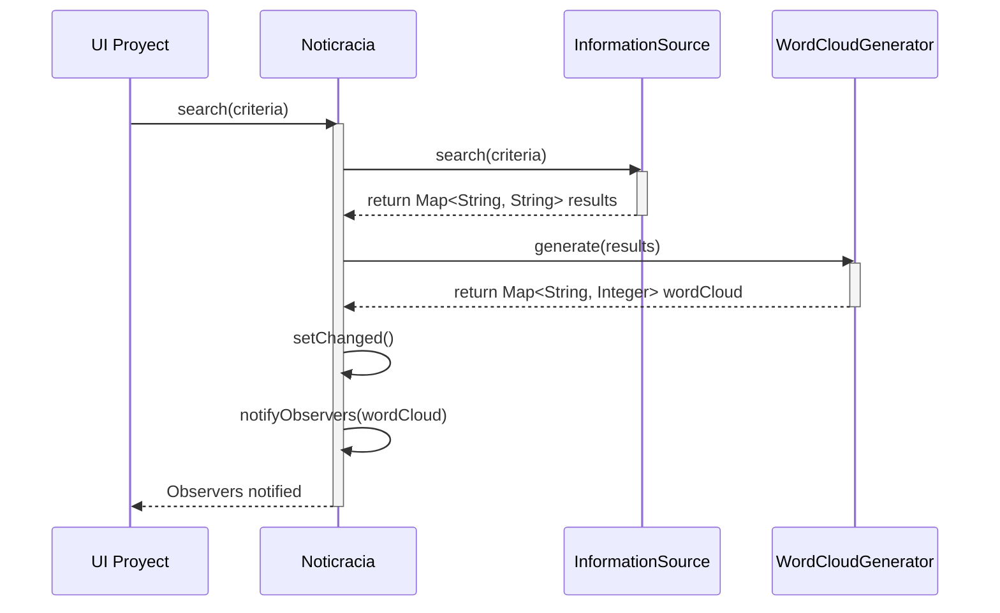

# Noticracia

## Diagrama de clases completo (Simplificar para el informe y pasarlo a otra herramienta)


## Diagrama de secuencia de inicialización de Noticracia



## Diagrama de secuencia de inicialización de Noticracia (versión para https://www.websequencediagrams.com/)
### Usenlo para el informe

```mermaid
participant ""
participant Noticracia as Noticracia
participant PathValidator as PathValidator
participant InformationSourceFactory as InformationSourceFactory
participant InformationSourceDiscoverer as InformationSourceDiscoverer
participant InformationSource as InformationSource

""->>Noticracia: new Noticracia(path)
activate Noticracia
Noticracia->>PathValidator: validate(path)
activate PathValidator
PathValidator-->>Noticracia: Valid path
deactivate PathValidator
Noticracia->>InformationSourceFactory: createInformationSource(path)
activate InformationSourceFactory
InformationSourceFactory->>InformationSourceDiscoverer: discover(path)
activate InformationSourceDiscoverer
InformationSourceDiscoverer-->>InformationSourceFactory: return Set<Class<? extends InformationSource>>
deactivate InformationSourceDiscoverer
InformationSourceFactory->>InformationSource: new InformationSource
activate InformationSource
InformationSource-->>InformationSourceFactory: return InformationSource instance
deactivate InformationSource
InformationSourceFactory-->>Noticracia: return informationSource
deactivate InformationSourceFactory
Noticracia-->>"": Instance ready
deactivate Noticracia
```

## Generación de nube



## Generación de nube, versión para https://www.websequencediagrams.com/

```mermaid
participant UI Proyect
participant Noticracia as Noticracia
participant InformationSource as InformationSource
participant WordCloudGenerator as WordCloudGenerator

UI Proyect->>Noticracia: search(criteria)
activate Noticracia
Noticracia->>InformationSource: search(criteria)
activate InformationSource
InformationSource-->>Noticracia: return Map<String, String> results
deactivate InformationSource
Noticracia->>WordCloudGenerator: generate(results)
activate WordCloudGenerator
WordCloudGenerator-->>Noticracia: return Map<String, Integer> wordCloud
deactivate WordCloudGenerator
Noticracia->>Noticracia: setChanged()
Noticracia->>Noticracia: notifyObservers(wordCloud)
Noticracia-->>UI Proyect: Observers notified
deactivate Noticracia
```